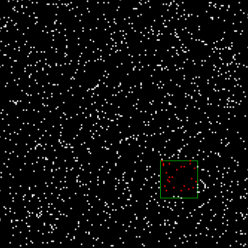

#Basic Spatial Hashing example.

MIT license.

Ivano Ras, 2018

Basic 2D example to show how spatial hashing (downsampled map) works.

Move the mouse over the openGL window while keeping the mouse button down. The green square is just for reference and it is anchored to the mouse position. The red neighborhood instead is the closest points to the mouse position.

#Instructions
1. pull the code
2. chmod +x main.py
3. ./main.py

NB: you may need to change the shebang in main.py

